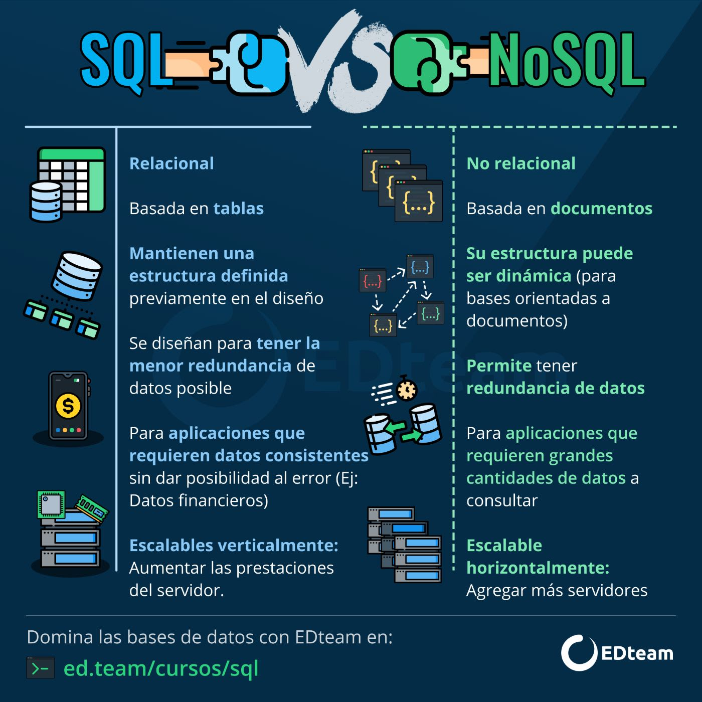

## CURSO DE FUNDAMENTOS DE BASES DE DATOS
###### Apuntes: Fuente curso Plaztzi 2024

### 1. BIENVENIDA CONCEPTOS BÁSICOS Y CONTEXTO HISTÓRICO DE LAS BASES DE DATOS

* Tipos de bases de datos:
    * Relacionales:En la industria hay varias compañías dedicadas a ser manejadoras de bases de datos relacionales como SQL Server, Oracle, MariaDB, entre otras.

    * No Relacionales: Todavía están avanzando y existen ejemplos muy distintos como cassandra, elasticsearch, neo4j, MongoDB, entre otras.

* Servicios:
    * Auto administrados: Es la base de datos que instalas tú y te encargas de actualizaciones, mantenimiento, etc.

    * Administrados: Servicios que ofrecen las nubes modernas como Azure y no debes preocuparte por mantenimiento o actualizaciones


### TIPOS DE BASES DE DATOS:
* Relacionales: Ejemplos, SQL server, MySQL, PostgreSQL, MariaDB, Oracle.

* No Relacionales: Cassandra, dinamon DB, Mongo DB.

##### HISTORIA DE LAS BASES DE DATOS RELACIONALES

[12 reglas de las BD:](https://es.wikipedia.org/wiki/12_reglas_de_Codd "Mayor detalle de las reglas de las BDs" )

[Aporte de un compañero](https://github.com/rb-one/Notas-fundamentos-bases-de-datos/blob/master/Notas/notas.md "Apuntes del curso")

### 3. Historia de las bases de datos relacionales
Las bases de datos surgen de la necesidad de conservar la información más allá de lo que existe en la memoria RAM.

### 4. Qué son entidades y atributos
* ¿Qué es una entidad?
    * Una entidad es algo similar a un objeto (programación orientada a objetos) y representa algo en el mundo real, incluso algo abstracto. Tienen atributos que son las cosas que los hacen ser una entidad y por convención se ponen en plural.

* Ejemplo de entidad en bases de datos
    * En la imagen puedes observar como ejemplo que la enidad Laptops posee diferentes atributos como colo, pantalla, año, modelo, etc.


* ¿Qué es un atributo?
    * Son las características o propiedades que describen a la entidad (se encierra en un óvalo). Los atributos se componen de:

Los atributos compuestos son aquellos que tienen atributos ellos mismos.

Los atributos llave son aquellos que identifican a la entidad y no pueden ser repetidos. Existen:

* Naturales: son inherentes al objeto como el número de serie
* Clave artificial: no es inherente al objeto y se asigna de manera arbitraria.
  
* Tipos de entidades
    * Entidades fuertes: son entidades que pueden sobrevivir por sí solas.

    * Entidades débiles: no pueden existir sin una entidad fuerte y se representan con un cuadrado con doble línea.

* Identidades débiles por identidad: no se diferencian entre sí más que por la clave de su identidad fuerte.
  
* Identidades débiles por existencia: se les asigna una clave propia.
Cómo representar las entidades en bases de datos

Existen varios tipos de notaciones para los modelos entidad relacionamiento. Chen es uno de los más utilizados para diagramar lógicamente la base de datos. Aquí te mostramos un ejemplo.


### Entidades de Platzi Blog


### Relaciones
Las relaciones tienen una propiedad llamada cardinalidad y tiene que ver con números. Cuántos de un lado pertenecen a cuántos del otro lado:

* Cardinalidad: 1 a 1
* Cardinalidad: 0 a 1
* Cardinalidad: 1 a N
* Cardinalidad: 0 a N
  


### Relaciones Múltiples muchos


### Diagrama ER
Un diagrama es como un mapa y nos ayuda a entender cuáles son las entidades con las que vamos a trabajar, cuáles son sus relaciones y qué papel van a jugar en las aplicaciones de la base de datos.


### Diagrama Físico: tipos de datos y constraints
Tipos de dato:

* Texto: CHAR(n), VARCHAR(n), TEXT
* Números: INTEGER, BIGINT, SMALLINT, DECIMAL(n,s), NUMERIC(n,s)
* Fecha/hora: DATE, TIME, DATETIME, TIMESTAMP
* Lógicos: BOOLEAN

Constraints (Restricciones)

* NOT NULL: Se asegura que la columna no tenga valores nulos
* UNIQUE: Se asegura que cada valor en la columna no se repita
* PRIMARY KEY: Es una combinación de NOT NULL y UNIQUE
* FOREIGN KEY: Identifica de manera única una tupla en otra tabla
* CHECK: Se asegura que el valor en la columna cumpla una condición dada
* DEFAULT: Coloca un valor por defecto cuando no hay un valor especificado
* INDEX: Se crea por columna para permitir búsquedas más rápidas


### Diagrama Físico: normalización

>Primera Forma Normal (1NF): Se asegura de que cada celda en una tabla contenga un solo valor, evitando la repetición de grupos de datos y permitiendo la identificación única de cada fila. Para lograr esto, se deben eliminar los valores repetidos en las columnas.

>Segunda Forma Normal (2NF): Se asegura de que todos los campos no clave de una tabla dependan completamente de la clave primaria. Esto significa que no debe haber dependencias parciales de la clave primaria; cada atributo no clave debe depender de toda la clave primaria.

>Tercera Forma Normal (3NF): Se asegura de que no existan dependencias transitivas entre las columnas no clave. En otras palabras, si un campo no clave depende de otro campo no clave, pero también depende de la clave primaria, se deben crear tablas adicionales para evitar esta dependencia transitiva.


### Diagrama Físico: normalizando Platziblog

* Diagrama BD Posts


```SQL
* (PK): Primary key
* (FK): Foreign Key
* (NN): Not Null
* (NN - UNIQUE): No valor nulo y unico
```


### Instalación local de un RDBMS (Windows)

Hay dos maneras de acceder a manejadores de bases de datos:

* Instalar en máquina local un administrador de bases relacional.
* Tener ambientes de desarrollo especiales o servicios cloud.
En este curso usaremos MySQL porque tiene un impacto histórico siendo muy utilizado y además es software libre y gratuito. La versión 5.6.43 es compatible con la mayoría de aplicaciones y frameworks.

* Root es el usuario principal que tendrá todos los permisos y por lo tanto en ambientes de producción hay que tener mucho cuidado al configurarlo.

[Link de descarga MYSQL](https://www.mysql.com/downloads/)

### ¿Qué es RDB y RDBMS?

RDBMS (Relational DataBase Management System) Sistema Manejador de Bases de datos relacionales.

La diferencia entre ambos es que las BBDD son un conjunto de datos pertenecientes ( o al menos en teoría) a un mismo tipo de contexto, que guarda los datos de forma persistente para un posterior uso, y el Sistema de gestión de BBDD o sistema manejador, es el que nos permite acceder a ella, es un software, herramienta que sirve de conexión entre las BBDD y el usuario (nos presenta una interfaz para poder gestionarla, manejarla).

#### RDBMS
* MySQL
* PostgreSQL
* Etc
  
Todas toman un lenguaje base, pero cada uno lo apropia, imponiéndole diferentes reglas y características.


### Clientes gráficos

* MySQL Workbench

### Servicios administrados
Hoy en día muchas empresas ya no tienen instalados en sus servidores los RDBMS sino que los contratan a otras personas. Estos servicios administrados cloud te permiten concentrarte en la base de datos y no en su administración y actualización.

### Historia de SQL

SQL significa Structured Query Language y tiene una estructura clara y fija. Su objetivo es hacer un solo lenguaje para consultar cualquier manejador de bases de datos volviéndose un gran estándar.

Ahora existe el NOSQL o Not Only Structured Query Language que significa que no sólo se utiliza SQLen las bases de datos no relacionales.




### DDL DATA DEFINITION LANGUAGE create

SQL tiene dos grandes sublenguajes:

DDL o Data Definition Language que nos ayuda a crear la estructura de una base de datos. Existen 3 grandes comandos:

* Create: Nos ayuda a crear bases de datos, tablas, vistas, índices, etc.
* Alter: Ayuda a alterar o modificar entidades.
* Drop: Nos ayuda a borrar. Hay que tener cuidado al utilizarlo.
  

3 objetos que manipularemos con el lenguaje DDL: Database o bases de datos

Table o tablas. Son la traducción a SQL de las entidades
View o vistas: Se ofrece la proyección de los datos de la base de datos de forma entendible.

```SQL
Create Database Prueba;
Use Prueba;

-- Inserta tu sentencia aqui
CREATE TABLE IF NOT EXISTS people (
person_id INTEGER PRIMARY KEY AUTOINCREMENT NOT NULL,
last_name VARCHAR(255) NULL,
first_name VARCHAR(255) NULL,
address VARCHAR(255) NULL,
city VARCHAR(255) NULL
);

SELECT * FROM platziblog.people;

```

### CREATE VIEW y DDL ALTER

```SQL

-- Create view

Create view v_brasil_customers as
SELECT customer_name,
contact_name
FROM Customers WHERE country = 'Brasil';

--EJERCICIO

DELETE FROM people; -- Elimina la información dentro de la tabla.
ALTER TABLE people AUTO_INCREMENT = 1 ; -- Reinicia el autoincrement a 1
INSERT INTO people (last_name,first_name,address,city)VALUES('Vázquez', 'Israel','Calle Famosa Num 1','México'),
('Hernández','Mónica','Reforma 222','México'),
('Alanis','Edgar','Central 1', 'Monterrey'); -- Insertar datos a la tabla

CREATE OR REPLACE VIEW platzi_people AS -- Crear vista
SELECT * FROM people;

select * from platzi_people; -- consultar vista

ALTER TABLE people ADD COLUMN date_of_birth DATETIME NULL AFTER city; -- Agregar columna
DESCRIBE people;
ALTER TABLE people DROP COLUMN date_of_birth; -- Eliminar columna
DESCRIBE people;

```

### DDL drop    

* Está puede ser la sentencia ¡más peligrosa! (????), sobre todo cuando somos principiantes. Básicamente borra o desaparece de nuestra base de datos algún elemento.


```SQL
-- DROP

DROP TABLE people;
DROP DATABASE test_db;

```

### Playground: VIEW, ALTER y DROP en SQL


```SQL
-- Escribe aquí tu código SQL 👇
CREATE VIEW v_madrid_customers AS
SELECT person_id, last_name, first_name
FROM people
WHERE city = "Madrid";

SELECT * FROM v_madrid_customers;

ALTER TABLE people
ADD COLUMN date_of_birth DATE;

ALTER TABLE people
DROP COLUMN address;


--NUEVO EJERCICIO

CREATE TABLE people (
	person_id INT,
	last_name VARCHAR(255),
	first_name VARCHAR(255),
	address VARCHAR(255),
	city VARCHAR(255));

INSERT INTO people (last_name,first_name,address, city)
VALUES('Hernandez','Laura','Calle 21','Monterrey');

SELECT last_name,first_name FROM people;


```

### DML DATA MANIPULATION LANGUAGE

DML trata del contenido de la base de datos. Son las siglas de Data Manipulation Language y sus comandos son:

* Insert: Inserta o agrega nuevos registros a la tabla.
* Update: Actualiza o modifica los datos que ya existen.
* Delete: Esta sentencia es riesgosa porque puede borrar el contenido de una tabla.
* Select: Trae información de la base de datos.


### Creando Platziblog: tablas independientes

* Una buena práctica es comenzar creando las entidades que no tienen una llave foránea.
* Generalmente en los nombres de bases de datos se evita usar eñes o acentos para evitar problemas en los manejadores de las bases de datos.

```SQL
-- Creando Platziblog: tablas independientes


/*creacion de base de datos PlatziBlog*/
create database PlatziBlog default character set utf8 ;

/*linia para utilizar PlatziBlog*/
use PlatziBlog;

/*construccion de tablas independientes*/
create table categorias
(
id int not null auto_increment,
nom_categoria varchar(30) not null,
constraint primary key (id)
);

create table etiquetas
(
id int not null auto_increment,
nom_etiquetas varchar(30) not null,
constraint primary key (id)
);

create table usuarios 
(
  id int not null auto_increment,
  login varchar(30) not null,
  pasword varchar(32) not null,
  nickname varchar(40) not null,
  email varchar(40) not null,
  primary key (id),
  unique key email_unique (email)
)

```


### Creando Platziblog: tablas dependientes

* El comando “cascade” sirve para que cada que se haga un update en la tabla principal, se refleje también en la tabla en la que estamos creando la relación.
  
```SQL
CREATE TABLE posts(
id INT,
titulo VARCHAR(130) NOT NULL,
fecha_publicacion TIMESTAMP,
contenido TEXT NOT NULL,
estatus CHAR(8) DEFAULT "activo",
usuario_id INT NOT NULL,
categoria_id INT NOT NULL,
PRIMARY KEY (id),
FOREIGN KEY (usuario_id) REFERENCES usuarios(id) ON UPDATE CASCADE ON DELETE NO ACTION,
FOREIGN KEY (categoria_id) REFERENCES categorias(id)


```


