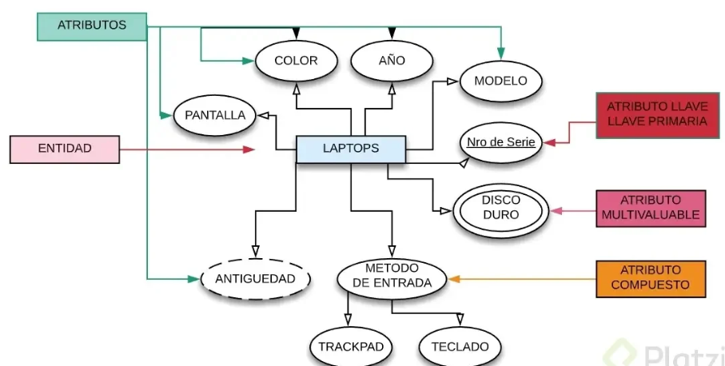
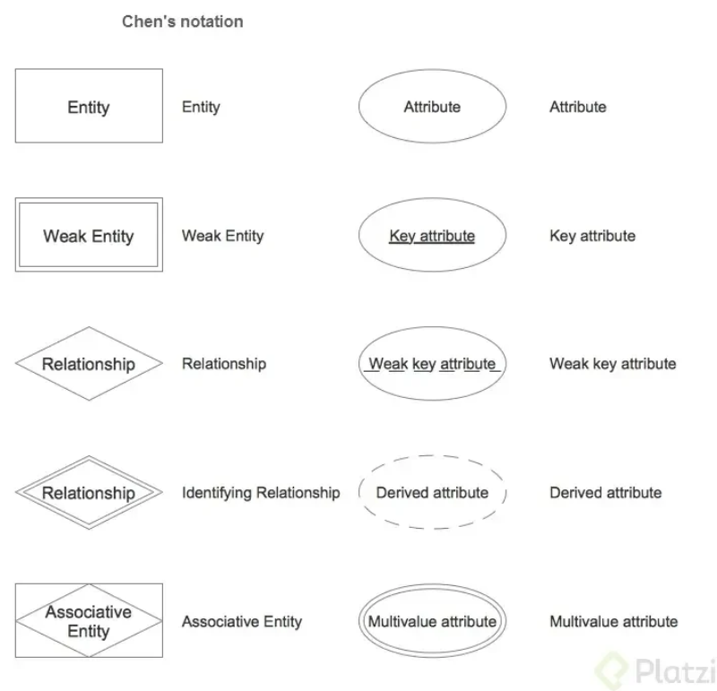
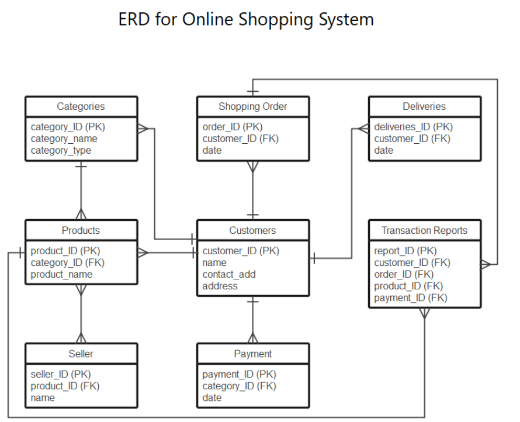
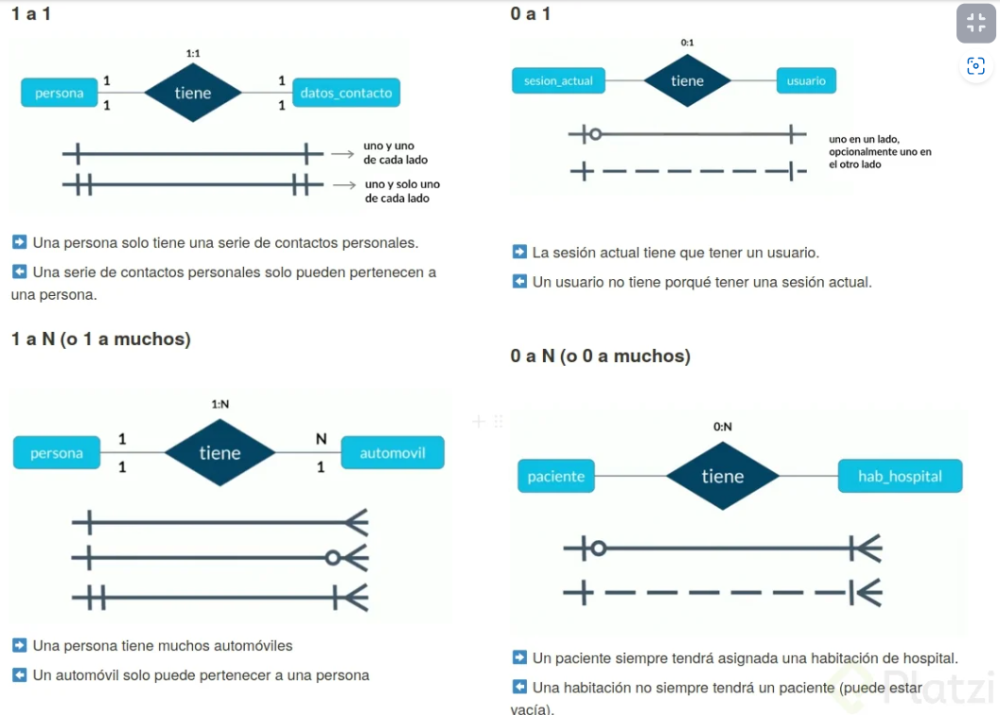
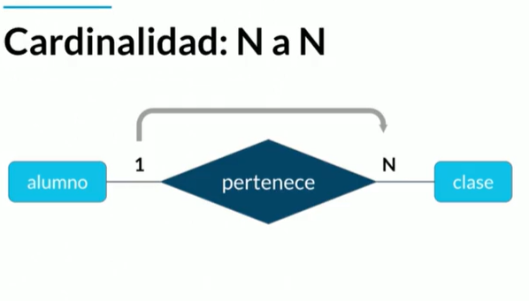

## CURSO DE FUNDAMENTOS DE BASES DE DATOS
###### Fuente curso Plaztzi 2024

### 1. BIENVENIDA CONCEPTOS BÁSICOS Y CONTEXTO HISTÓRICO DE LAS BASES DE DATOS

* Tipos de bases de datos:
    * Relacionales:En la industria hay varias compañías dedicadas a ser manejadoras de bases de datos relacionales como SQL Server, Oracle, MariaDB, entre otras.

    * No Relacionales: Todavía están avanzando y existen ejemplos muy distintos como cassandra, elasticsearch, neo4j, MongoDB, entre otras.

* Servicios:
    * Auto administrados: Es la base de datos que instalas tú y te encargas de actualizaciones, mantenimiento, etc.

    * Administrados: Servicios que ofrecen las nubes modernas como Azure y no debes preocuparte por mantenimiento o actualizaciones

### TIPOS DE BASES DE DATOS:
* Relacionales: Ejemplos, SQL server, MySQL, PostgreSQL, MariaDB, Oracle.

* No Relacionales: Cassandra, dinamon DB, Mongo DB.

##### HISTORIA DE LAS BASES DE DATOS RELACIONALES

[12 reglas de las BD:](https://es.wikipedia.org/wiki/12_reglas_de_Codd "Mayor detalle de las reglas de las BDs" )

[Aporte de un compañero](https://github.com/rb-one/Notas-fundamentos-bases-de-datos/blob/master/Notas/notas.md "Apuntes del curso")

### 3. Historia de las bases de datos relacionales
Las bases de datos surgen de la necesidad de conservar la información más allá de lo que existe en la memoria RAM.

### 4. Qué son entidades y atributos
* ¿Qué es una entidad?
    * Una entidad es algo similar a un objeto (programación orientada a objetos) y representa algo en el mundo real, incluso algo abstracto. Tienen atributos que son las cosas que los hacen ser una entidad y por convención se ponen en plural.

* Ejemplo de entidad en bases de datos
    * En la imagen puedes observar como ejemplo que la enidad Laptops posee diferentes atributos como colo, pantalla, año, modelo, etc.

* ¿Qué es un atributo?
    * Son las características o propiedades que describen a la entidad (se encierra en un óvalo). Los atributos se componen de:

Los atributos compuestos son aquellos que tienen atributos ellos mismos.

Los atributos llave son aquellos que identifican a la entidad y no pueden ser repetidos. Existen:

* Naturales: son inherentes al objeto como el número de serie
* Clave artificial: no es inherente al objeto y se asigna de manera arbitraria.
  
* Tipos de entidades
    * Entidades fuertes: son entidades que pueden sobrevivir por sí solas.

    * Entidades débiles: no pueden existir sin una entidad fuerte y se representan con un cuadrado con doble línea.

* Identidades débiles por identidad: no se diferencian entre sí más que por la clave de su identidad fuerte.
  
* Identidades débiles por existencia: se les asigna una clave propia.
Cómo representar las entidades en bases de datos

Existen varios tipos de notaciones para los modelos entidad relacionamiento. Chen es uno de los más utilizados para diagramar lógicamente la base de datos. Aquí te mostramos un ejemplo.

### Entidades de Platzi Blog

### Relaciones
Las relaciones tienen una propiedad llamada cardinalidad y tiene que ver con números. Cuántos de un lado pertenecen a cuántos del otro lado:

* Cardinalidad: 1 a 1
* Cardinalidad: 0 a 1
* Cardinalidad: 1 a N
* Cardinalidad: 0 a N
  

### Múltiples muchos

