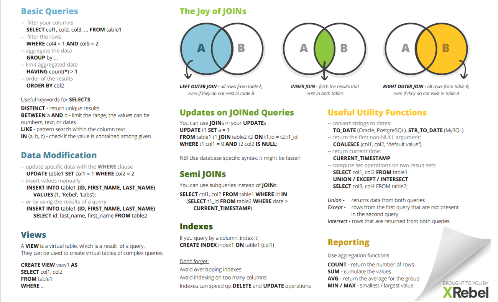

## CURSO DE FUNDAMENTOS DE BASES DE DATOS
###### Apuntes: Fuente curso Plaztzi 2024

### 1. BIENVENIDA CONCEPTOS BÁSICOS Y CONTEXTO HISTÓRICO DE LAS BASES DE DATOS

* Tipos de bases de datos:
    * Relacionales:En la industria hay varias compañías dedicadas a ser manejadoras de bases de datos relacionales como SQL Server, Oracle, MariaDB, entre otras.

    * No Relacionales: Todavía están avanzando y existen ejemplos muy distintos como cassandra, elasticsearch, neo4j, MongoDB, entre otras.

* Servicios:
    * Auto administrados: Es la base de datos que instalas tú y te encargas de actualizaciones, mantenimiento, etc.

    * Administrados: Servicios que ofrecen las nubes modernas como Azure y no debes preocuparte por mantenimiento o actualizaciones


### TIPOS DE BASES DE DATOS:
* Relacionales: Ejemplos, SQL server, MySQL, PostgreSQL, MariaDB, Oracle.

* No Relacionales: Cassandra, dinamon DB, Mongo DB.

##### HISTORIA DE LAS BASES DE DATOS RELACIONALES

[12 reglas de las BD:](https://es.wikipedia.org/wiki/12_reglas_de_Codd "Mayor detalle de las reglas de las BDs" )

[Aporte de un compañero](https://github.com/rb-one/Notas-fundamentos-bases-de-datos/blob/master/Notas/notas.md "Apuntes del curso")

### 3. Historia de las bases de datos relacionales
Las bases de datos surgen de la necesidad de conservar la información más allá de lo que existe en la memoria RAM.

### 4. Qué son entidades y atributos
* ¿Qué es una entidad?
    * Una entidad es algo similar a un objeto (programación orientada a objetos) y representa algo en el mundo real, incluso algo abstracto. Tienen atributos que son las cosas que los hacen ser una entidad y por convención se ponen en plural.

* Ejemplo de entidad en bases de datos
    * En la imagen puedes observar como ejemplo que la enidad Laptops posee diferentes atributos como colo, pantalla, año, modelo, etc.


* ¿Qué es un atributo?
    * Son las características o propiedades que describen a la entidad (se encierra en un óvalo). Los atributos se componen de:

Los atributos compuestos son aquellos que tienen atributos ellos mismos.

Los atributos llave son aquellos que identifican a la entidad y no pueden ser repetidos. Existen:

* Naturales: son inherentes al objeto como el número de serie
* Clave artificial: no es inherente al objeto y se asigna de manera arbitraria.
  
* Tipos de entidades
    * Entidades fuertes: son entidades que pueden sobrevivir por sí solas.

    * Entidades débiles: no pueden existir sin una entidad fuerte y se representan con un cuadrado con doble línea.

* Identidades débiles por identidad: no se diferencian entre sí más que por la clave de su identidad fuerte.
  
* Identidades débiles por existencia: se les asigna una clave propia.
Cómo representar las entidades en bases de datos

Existen varios tipos de notaciones para los modelos entidad relacionamiento. Chen es uno de los más utilizados para diagramar lógicamente la base de datos. Aquí te mostramos un ejemplo.


### Entidades de Platzi Blog


### Relaciones
Las relaciones tienen una propiedad llamada cardinalidad y tiene que ver con números. Cuántos de un lado pertenecen a cuántos del otro lado:

* Cardinalidad: 1 a 1
* Cardinalidad: 0 a 1
* Cardinalidad: 1 a N
* Cardinalidad: 0 a N
  


### Relaciones Múltiples muchos


### Diagrama ER
Un diagrama es como un mapa y nos ayuda a entender cuáles son las entidades con las que vamos a trabajar, cuáles son sus relaciones y qué papel van a jugar en las aplicaciones de la base de datos.


### Diagrama Físico: tipos de datos y constraints
Tipos de dato:

* Texto: CHAR(n), VARCHAR(n), TEXT
* Números: INTEGER, BIGINT, SMALLINT, DECIMAL(n,s), NUMERIC(n,s)
* Fecha/hora: DATE, TIME, DATETIME, TIMESTAMP
* Lógicos: BOOLEAN

Constraints (Restricciones)

* NOT NULL: Se asegura que la columna no tenga valores nulos
* UNIQUE: Se asegura que cada valor en la columna no se repita
* PRIMARY KEY: Es una combinación de NOT NULL y UNIQUE
* FOREIGN KEY: Identifica de manera única una tupla en otra tabla
* CHECK: Se asegura que el valor en la columna cumpla una condición dada
* DEFAULT: Coloca un valor por defecto cuando no hay un valor especificado
* INDEX: Se crea por columna para permitir búsquedas más rápidas


### Diagrama Físico: normalización

>Primera Forma Normal (1NF): Se asegura de que cada celda en una tabla contenga un solo valor, evitando la repetición de grupos de datos y permitiendo la identificación única de cada fila. Para lograr esto, se deben eliminar los valores repetidos en las columnas.

>Segunda Forma Normal (2NF): Se asegura de que todos los campos no clave de una tabla dependan completamente de la clave primaria. Esto significa que no debe haber dependencias parciales de la clave primaria; cada atributo no clave debe depender de toda la clave primaria.

>Tercera Forma Normal (3NF): Se asegura de que no existan dependencias transitivas entre las columnas no clave. En otras palabras, si un campo no clave depende de otro campo no clave, pero también depende de la clave primaria, se deben crear tablas adicionales para evitar esta dependencia transitiva.


### Diagrama Físico: normalizando Platziblog

* Diagrama BD Posts


```SQL
* (PK): Primary key
* (FK): Foreign Key
* (NN): Not Null
* (NN - UNIQUE): No valor nulo y unico
```


### Instalación local de un RDBMS (Windows)

Hay dos maneras de acceder a manejadores de bases de datos:

* Instalar en máquina local un administrador de bases relacional.
* Tener ambientes de desarrollo especiales o servicios cloud.
En este curso usaremos MySQL porque tiene un impacto histórico siendo muy utilizado y además es software libre y gratuito. La versión 5.6.43 es compatible con la mayoría de aplicaciones y frameworks.

* Root es el usuario principal que tendrá todos los permisos y por lo tanto en ambientes de producción hay que tener mucho cuidado al configurarlo.

[Link de descarga MYSQL](https://www.mysql.com/downloads/)

### ¿Qué es RDB y RDBMS?

RDBMS (Relational DataBase Management System) Sistema Manejador de Bases de datos relacionales.

La diferencia entre ambos es que las BBDD son un conjunto de datos pertenecientes ( o al menos en teoría) a un mismo tipo de contexto, que guarda los datos de forma persistente para un posterior uso, y el Sistema de gestión de BBDD o sistema manejador, es el que nos permite acceder a ella, es un software, herramienta que sirve de conexión entre las BBDD y el usuario (nos presenta una interfaz para poder gestionarla, manejarla).

#### RDBMS
* MySQL
* PostgreSQL
* Etc
  
Todas toman un lenguaje base, pero cada uno lo apropia, imponiéndole diferentes reglas y características.


### Clientes gráficos

* MySQL Workbench

### Servicios administrados
Hoy en día muchas empresas ya no tienen instalados en sus servidores los RDBMS sino que los contratan a otras personas. Estos servicios administrados cloud te permiten concentrarte en la base de datos y no en su administración y actualización.

### Historia de SQL

SQL significa Structured Query Language y tiene una estructura clara y fija. Su objetivo es hacer un solo lenguaje para consultar cualquier manejador de bases de datos volviéndose un gran estándar.

Ahora existe el NOSQL o Not Only Structured Query Language que significa que no sólo se utiliza SQLen las bases de datos no relacionales.


### DDL DATA DEFINITION LANGUAGE create

SQL tiene dos grandes sublenguajes:

DDL o Data Definition Language que nos ayuda a crear la estructura de una base de datos. Existen 3 grandes comandos:

* Create: Nos ayuda a crear bases de datos, tablas, vistas, índices, etc.
* Alter: Ayuda a alterar o modificar entidades.
* Drop: Nos ayuda a borrar. Hay que tener cuidado al utilizarlo.
  

3 objetos que manipularemos con el lenguaje DDL: Database o bases de datos

Table o tablas. Son la traducción a SQL de las entidades
View o vistas: Se ofrece la proyección de los datos de la base de datos de forma entendible.

```SQL
Create Database Prueba;
Use Prueba;

-- Inserta tu sentencia aqui
CREATE TABLE IF NOT EXISTS people (
person_id INTEGER PRIMARY KEY AUTOINCREMENT NOT NULL,
last_name VARCHAR(255) NULL,
first_name VARCHAR(255) NULL,
address VARCHAR(255) NULL,
city VARCHAR(255) NULL
);

SELECT * FROM platziblog.people;

```

### CREATE VIEW y DDL ALTER

```SQL

-- Create view

Create view v_brasil_customers as
SELECT customer_name,
contact_name
FROM Customers WHERE country = 'Brasil';

--EJERCICIO

DELETE FROM people; -- Elimina la información dentro de la tabla.
ALTER TABLE people AUTO_INCREMENT = 1 ; -- Reinicia el autoincrement a 1
INSERT INTO people (last_name,first_name,address,city)VALUES('Vázquez', 'Israel','Calle Famosa Num 1','México'),
('Hernández','Mónica','Reforma 222','México'),
('Alanis','Edgar','Central 1', 'Monterrey'); -- Insertar datos a la tabla

CREATE OR REPLACE VIEW platzi_people AS -- Crear vista
SELECT * FROM people;

select * from platzi_people; -- consultar vista

ALTER TABLE people ADD COLUMN date_of_birth DATETIME NULL AFTER city; -- Agregar columna
DESCRIBE people;
ALTER TABLE people DROP COLUMN date_of_birth; -- Eliminar columna
DESCRIBE people;

```

### DDL drop    

* Está puede ser la sentencia ¡más peligrosa! (????), sobre todo cuando somos principiantes. Básicamente borra o desaparece de nuestra base de datos algún elemento.


```SQL
-- DROP

DROP TABLE people;
DROP DATABASE test_db;

```

### Playground: VIEW, ALTER y DROP en SQL


```SQL
-- Escribe aquí tu código SQL 👇
CREATE VIEW v_madrid_customers AS
SELECT person_id, last_name, first_name
FROM people
WHERE city = "Madrid";

SELECT * FROM v_madrid_customers;

ALTER TABLE people
ADD COLUMN date_of_birth DATE;

ALTER TABLE people
DROP COLUMN address;


--NUEVO EJERCICIO

CREATE TABLE people (
	person_id INT,
	last_name VARCHAR(255),
	first_name VARCHAR(255),
	address VARCHAR(255),
	city VARCHAR(255));

INSERT INTO people (last_name,first_name,address, city)
VALUES('Hernandez','Laura','Calle 21','Monterrey');

SELECT last_name,first_name FROM people;


```

### DML DATA MANIPULATION LANGUAGE

DML trata del contenido de la base de datos. Son las siglas de Data Manipulation Language y sus comandos son:

* Insert: Inserta o agrega nuevos registros a la tabla.
* Update: Actualiza o modifica los datos que ya existen.
* Delete: Esta sentencia es riesgosa porque puede borrar el contenido de una tabla.
* Select: Trae información de la base de datos.


### Creando Platziblog: tablas independientes

* Una buena práctica es comenzar creando las entidades que no tienen una llave foránea.
* Generalmente en los nombres de bases de datos se evita usar eñes o acentos para evitar problemas en los manejadores de las bases de datos.

```SQL
-- Creando Platziblog: tablas independientes


/*creacion de base de datos PlatziBlog*/
create database PlatziBlog default character set utf8 ;

/*linia para utilizar PlatziBlog*/
use PlatziBlog;

/*construccion de tablas independientes*/
create table categorias
(
id int not null auto_increment,
nom_categoria varchar(30) not null,
constraint primary key (id)
);

create table etiquetas
(
id int not null auto_increment,
nom_etiquetas varchar(30) not null,
constraint primary key (id)
);

create table usuarios 
(
  id int not null auto_increment,
  login varchar(30) not null,
  pasword varchar(32) not null,
  nickname varchar(40) not null,
  email varchar(40) not null,
  primary key (id),
  unique key email_unique (email)
)

```


### Creando Platziblog: tablas dependientes

* El comando “cascade” sirve para que cada que se haga un update en la tabla principal, se refleje también en la tabla en la que estamos creando la relación.
  
```SQL
CREATE TABLE posts(
id INT,
titulo VARCHAR(130) NOT NULL,
fecha_publicacion TIMESTAMP,
contenido TEXT NOT NULL,
estatus CHAR(8) DEFAULT "activo",
usuario_id INT NOT NULL,
categoria_id INT NOT NULL,
PRIMARY KEY (id),
FOREIGN KEY (usuario_id) REFERENCES usuarios(id) ON UPDATE CASCADE ON DELETE NO ACTION,
FOREIGN KEY (categoria_id) REFERENCES categorias(id)


```
### Creando Platziblog: tablas transitivas

* Las tablas transitivas sirven como puente para unir dos tablas. No tienen contenido semántico.
  
* Reverse Engineer nos reproduce el esquema del cual nos basamos para crear nuestras tablas. Es útil cuando llegas a un nuevo trabajo y quieres entender cuál fue la mentalidad que tuvieron al momento de crear las bases de datos.

# TODO EL CODIGO DE SQL AVANCE DE LAS CLASES

```SQL
-- CREATE database platziblog;
use platziblog;


CREATE TABLE people (
	person_id INT,
	last_name VARCHAR(255),
	first_name VARCHAR(255),
	address VARCHAR(255),
	city VARCHAR(255));

INSERT INTO people (last_name,first_name,address, city)
VALUES('Hernandez','Laura','Calle 21','Monterrey');

SELECT last_name,first_name FROM people;

-- Creando Platziblog: tablas independientes


/*creacion de base de datos PlatziBlog*/
create database PlatziBlog default character set utf8 ;

/*linia para utilizar PlatziBlog*/
use PlatziBlog;

/*construccion de tablas independientes*/
create table categorias
(
id int not null auto_increment,
nom_categoria varchar(30) not null,
constraint primary key (id)
);

create table etiquetas
(
id int not null auto_increment,
nom_etiquetas varchar(30) not null,
constraint primary key (id)
);

create table usuarios 
(
  id int not null auto_increment,
  login varchar(30) not null,
  pasword varchar(32) not null,
  nickname varchar(40) not null,
  email varchar(40) not null,
  primary key (id),
  unique key email_unique (email)
);


CREATE TABLE posts(
id INT,
titulo VARCHAR(130) NOT NULL,
fecha_publicacion TIMESTAMP,
contenido TEXT NOT NULL,
estatus CHAR(8) DEFAULT "activo",
usuario_id INT NOT NULL,
categoria_id INT NOT NULL,
PRIMARY KEY (id),
FOREIGN KEY (usuario_id) REFERENCES usuarios(id) ON UPDATE CASCADE ON DELETE NO ACTION,
FOREIGN KEY (categoria_id) REFERENCES categorias(id)
);


create table comentarios(
id int not null auto_increment primary key,
comentario text not null,
usuario_id int not null,
posts_id int not null,
foreign key (usuario_id) references usuarios(id) on delete cascade on update cascade,
foreign key (posts_id) references posts(id) on delete cascade on update cascade
);


-- tabla transitiva
create table posts_etiquetas(
id int not null auto_increment primary key,
posts_id int not null,
etiqueta_id int not null,
foreign key (posts_id) references posts(id) on delete no action on update no action,
foreign key (etiqueta_id) references etiquetas(id) on delete no action on update no action
);


```


## ¿Por qué las consultas son tan importantes?

Las consultas o queries a una base de datos son una parte fundamental ya que esto podría salvar un negocio o empresa.
Alrededor de las consultas a las bases de datos se han creado varias especialidades como ETL o transformación de datos, business intelligence e incluso machine learning.

## Estructura básica de un Query

Los queries son la forma en la que estructuramos las preguntas que se harán a la base de datos. Transforma preguntas en sintaxis.

El query tiene básicamente 2 partes: SELECT y FROM y puede aparecer una tercera como WHERE.

* La estrellita o asterisco (*) quiere decir que vamos a seleccionar todo sin filtrar campos.


.png)


## SELECT

SELECT se encarga de proyectar o mostrar datos.

* El nombre de las columnas o campos que estamos consultando puede ser cambiado utilizando AS después del nombre del campo y poniendo el nuevo que queremos tener:
SELECT titulo AS encabezado
FROM posts;

* Existe una función de SELECT para poder contar la cantidad de registros. Esa información (un número) será el resultado del query:
SELECT COUNT(*)
FROM posts;


## Playground: SELECT en SQL
```SQL
SELECT * FROM cursos;

SELECT COUNT (*) AS cantidad
FROM cursos;

SELECT nombre AS name, profe AS teacher, n_calificaciones AS n_reviews
FROM cursos;
```
## FROM y SQL JOINs

FROM indica de dónde se deben traer los datos y puede ayudar a hacer sentencias y filtros complejos cuando se quieren unir tablas. La sentencia compañera que nos ayuda con este proceso es JOIN.

Los diagramas de Venn son círculos que se tocan en algún punto para ver dónde está la intersección de conjuntos. Ayudan mucho para poder formular la sentencia JOIN de la manera adecuada dependiendo del query que se quiere hacer.


## Utilizando la sentencia FROM

* Consultas en SQL

```SQL
SELECT * FROM usuarios
	LEFT JOIN posts ON usuarios.id = posts.usuario_id
WHERE posts.usuario_id is null;

SELECT * FROM usuarios
	RIGHT JOIN posts ON usuarios.id = posts.usuario_id
 WHERE posts.usuario_id is null;

SELECT * FROM usuarios
	INNER JOIN posts ON usuarios.id = posts.usuario_id;

SELECT * FROM usuarios
	LEFT JOIN posts ON usuarios.id = posts.usuario_id
UNION
SELECT * FROM usuarios
	RIGHT JOIN posts ON usuarios.id = posts.usuario_id

```


## Playground: FROM y LEFT JOIN en SQL

```SQL
SELECT 
	courses.id as id, 
	courses.name as name, 
	teacher_id, 
teachers.name as teacher_name
FROM courses 
  LEFT JOIN teachers on teachers.course_id = courses.id
where teacher_id is not null;
```

## WHERE

WHERE es la sentencia que nos ayuda a filtrar tuplas o registros dependiendo de las características que elegimos.

* La propiedad LIKE nos ayuda a traer registros de los cuales conocemos sólo una parte de la información.
  
* La propiedad BETWEEN nos sirve para arrojar registros que estén en el medio de dos. Por ejemplo los registros con id entre 20 y 30.

```SQL
SELECT * FROM posts WHERE titulo LIKE '%escandalo%';

SELECT * FROM posts WHERE fecha_publicacion > '2025-01-01';

SELECT * FROM posts WHERE fecha_publicacion BETWEEN '2023-01-01' AND '2025-01-01';

SELECT * FROM posts WHERE month(fecha_publicacion) = '04';


```


## Utilizando la sentencia WHERE nulo y no nulo

El valor nulo en una tabla generalmente es su valor por defecto cuando nadie le asignó algo diferente. La sintaxis para hacer búsquedas de datos nulos es IS NULL. La sintaxis para buscar datos que no son nulos es IS NOT NULL


```SQL
SELECT * FROM posts WHERE usuario_id IS not NULL AND estatus = 'activo' AND id <50
AND categoria_id = 2 AND year(fecha_publicacion) ='2025';

```

## GROUP BY

GROUP BY tiene que ver con agrupación. Indica a la base de datos qué criterios debe tener en cuenta para agrupar.

Se usa para informes:

```SQL
SELECT estatus, COUNT(*) posts_quantity
FROM posts
GROUP BY estatus;

-- Agrupando por año de post
SELECT year(fecha_publicacion) post_year, COUNT(*) as posts_quantity
FROM posts
GROUP BY post_year;

-- Agrupando por MES
SELECT monthname(fecha_publicacion) post_month, COUNT(*) as posts_quantity
FROM posts
GROUP BY post_month;


-- Agrupación por year - month
SELECT year(fecha_publicacion) as post_year,monthname(fecha_publicacion) AS post_month, COUNT(*) AS post_quantity
FROM posts
GROUP BY post_year, post_month;

-- Agrupado por estatus y mes
SELECT estatus, monthname(fecha_publicacion) post_month, COUNT(*) as posts_quantity
FROM posts
GROUP BY estatus, post_month;
```

## ORDER BY y HAVING

La sentencia ORDER BY tiene que ver con el ordenamiento de los datos dependiendo de los criterios que quieras usar.

* ASC sirve para ordenar de forma ascendente.
* DESC sirve para ordenar de forma descendente.
* LIMIT se usa para limitar la cantidad de resultados que arroja el query.
  
* ***HAVING tiene una similitud muy grande con WHERE, sin embargo el uso de 
  ellos depende del orden. Cuando se quiere seleccionar tuplas agrupadas únicamente se puede hacer con HAVING.***

```SQL
-- ORDER BY y HAVING

-- Encadenar consultas con HAVING
SELECT MONTHNAME(fecha_publicacion) AS mes, estatus, COUNT(*) AS cantidad
FROM posts
GROUP BY estatus, mes
HAVING cantidad > 1 AND mes IN ('December', 'May') ;

-- HAVING
SELECT MONTHNAME(fecha_publicacion) AS post_month, estatus, COUNT(*) AS post_quantity FROM posts
GROUP BY estatus, post_month
HAVING post_quantity >2
ORDER BY post_month;

-- SUB CONSULTA
SELECT * FROM (SELECT monthname(fecha_publicacion)AS post_month, estatus, COUNT(*) AS post_quantity 
FROM posts
GROUP BY estatus, post_month
ORDER BY post_month) AS Tabla1
WHERE Tabla1.post_quantity >2;
-- mismo resultado 2 formas de hacerlo
```


## Playground: Agrupamiento y Ordenamiento de Datos

```SQL
SELECT
  teachers.name AS teacher,
  SUM(courses.n_reviews) AS total_reviews
FROM teachers
INNER JOIN courses
ON teachers.id = courses.teacher_id
GROUP BY teacher
ORDER BY total_reviews DESC;
```

## El interminable agujero de conejo (Nested queries)

Los Nested queries significan que dentro de un query podemos hacer otro query. Esto sirve para hacer join de tablas, estando una en memoria. También teniendo un query como condicional del otro.

Este proceso puede ser tan profundo como quieras, teniendo infinitos queries anidados.
Se le conoce como un producto cartesiano ya que se multiplican todos los registros de una tabla con todos los del nuevo query. Esto provoca que el query sea difícil de procesar por lo pesado que puede resultar.


```SQL
-- EN EL FROM
SELECT new_table_projection.date, COUNT(*) AS post_count
FROM (
SELECT DATE(MIN(fecha_publicacion)) AS date, YEAR(fecha_publicacion) AS post_year
FROM posts
GROUP BY post_year) AS new_table_projection
GROUP BY new_table_projection.date
ORDER BY new_table_projection.date;

-- EN EL WHERE
SELECT * FROM posts
WHERE fecha_publicacion = (
SELECT MAX(fecha_publicacion)
FROM posts);
```


## ¿Cómo convertir una pregunta en un query SQL?

De pregunta a Query

* SELECT: Lo que quieres mostrar
* FROM: De dónde voy a tomar los datos
* WHERE: Los filtros de los datos que quieres mostrar
* GROUP BY: Los rubros por los que me interesa agrupar la información
* ORDER BY: El orden en que quiero presentar mi información
* HAVING: Los filtros que quiero que mis datos agrupados tengan


## Preguntándole a la base de datos

* GROUP_CONCAT toma el resultado del query y lo pone como campo separado por comas.

```SQL

-- PREGUNTANDOLE A LA BD
SELECT posts.titulo, COUNT(*) num_etiquetas FROM posts
	INNER JOIN posts_etiquetas ON posts.id = posts_etiquetas.post_id
    INNER JOIN etiquetas ON etiquetas.id = posts_etiquetas.etiqueta_id
    GROUP BY posts.id
    ORDER BY num_etiquetas DESC;


-- -- PREGUNTANDOLE A LA BD
SELECT * FROM etiquetas e
	LEFT JOIN posts_etiquetas pe
    ON e.id = pe.etiqueta_id
    WHERE pe.etiqueta_id IS NULL;
```





## Consultando PlatziBlog


```SQL
SELECT c.nombre_categoria, COUNT(*) AS cant_posts
    FROM posts as p
    LEFT JOIN categorias AS c ON c.id = p.categoria_id
    GROUP BY p.categoria_id
    ORDER BY cant_posts DESC;

-- MÁS POSTS por usuario
SELECT u.nickname, COUNT(*) AS num_posts
FROM usuarios AS u
LEFT JOIN posts AS p ON p.usuario_id = u.id
GROUP BY u.id
ORDER BY num_posts DESC;

-- POST POR USUARIO CANT Y CATG
SELECT u.nickname, COUNT(*) AS num_posts, GROUP_CONCAT(nombre_categoria) AS nom_categoria
FROM usuarios AS u
LEFT JOIN posts AS p ON p.usuario_id = u.id
LEFT JOIN categorias AS c ON p.categoria_id = c.id
GROUP BY u.id
ORDER BY num_posts DESC;

-- SIN POSTS
SELECT * FROM usuarios as u
LEFT JOIN posts AS p ON u.id = p.usuario_id
WHERE p.usuario_id IS NULL

```


## Playground: Prueba Final con PlatziBlog
Para resolver este desafio debes crear una tabla comentarios, agregar al menos 3 comentarios, imprimir todos los comentarios de la tabla y finalmente imprimir los comentarios de un usuario especial con un formato en específico.

Reto 1: crear la tabla
Crea una tabla comentarios con las columnas id, cuerpo_comentario, usuario_id y post_id.

id	cuerpo_comentario	usuario_id	post_id
...	...	...	...
Reto 2: agrega registros
Inserta al menos 3 comentarios en la tabla. Puedes escribir tantos comentarios como quieras. Asegúrate de que solo en 2 el usuario_id sea 1.

Reto 3: imprime registros
Imprime todas las columnas de todos los registros de la tabla comentarios.

Reto 4: imprime registros del usuario 1
Selecciona los 2 comentarios del usuario 1. Haz un JOIN para conseguir la información del post relacionado con la propiedad post_id y el usuario rerlacionado con la propiedad usuario_id. Imprime la propiedad comentarios.cuerpo_comentario como comentario, usuarios.login como usuario y posts.titulo como post.

comentario	usuario	post
...	israel	...
...	israel	...

```SQL
-- Reto 1
CREATE TABLE IF NOT EXISTS comentarios (
  id INTEGER PRiMARY KEY NOT NULL,
  cuerpo_comentario TEXT NOT NULL,
  usuario_id INTEGER NOT NULL,
  post_id INTEGER NOT NULL,
  FOREIGN KEY (usuario_id) REFERENCES usuarios(id)
  FOREIGN KEY (post_id) REFERENCES posts(id)
);

-- Reto 2
INSERT INTO comentarios (
  id, cuerpo_comentario, usuario_id, post_id
) 
VALUES
(1,"Comentario 1", 2, 54),
(2,"Comentario 2", 1, 43),
(3,"Comentario 3", 1, 43);

-- Reto 3
SELECT * FROM comentarios;

-- Reto 4
SELECT comentarios.cuerpo_comentario AS comentario,
usuarios.login AS usuario, posts.titulo AS post
FROM comentarios
INNER JOIN posts ON 
posts.id = comentarios.post_id
INNER JOIN usuarios ON 
usuarios.id = comentarios.usuario_id
WHERE comentarios.usuario_id = 1;
```


# ¿Qué son y cuáles son los tipos de bases de datos no relacionales?

Respecto a las bases de datos no relacionales, no existe un solo tipo, aunque se engloben en una sola categoría.

**Tipos de bases de datos no relacionales:**


* Clave - valor: Son ideales para almacenar y extraer datos con una clave única. Manejan los diccionarios de manera excepcional. Ejemplos: DynamoDB, Cassandra.
  
* Basadas en documentos: Son una implementación de clave valor que varía en la forma semiestructurada en que se trata la información. Ideal para almacenar datos JSON y XML. Ejemplos: MongoDB, Firestore.
  
* Basadas en grafos: Basadas en teoría de grafos, sirven para entidades que se encuentran interconectadas por múltiples relaciones. Ideales para almacenar relaciones complejas. Ejemplos: neo4j, TITAN.
  
* En memoria: Pueden ser de estructura variada, pero su ventaja radica en la velocidad, ya que al vivir en memoria la extracción de datos es casi inmediata. Ejemplos: Memcached, Redis.
  
* Optimizadas para búsquedas: Pueden ser de diversas estructuras, su ventaja radica en que se pueden hacer queries y búsquedas complejas de manera sencilla. Ejemplos: BigQuery, Elasticsearch.

## Servicios administrados y jerarquía de datos
Firebase es un servicio de Google donde puedes tercerizar muchos elementos en la nube.
Jerarquía de datos:

* Base de datos
* Colección
* Documento


## Top level collection con Firebase

El modelo de bases de datos no relacionales es un poco más cercano al mundo real en su comportamiento.

* Las top level collections son las colecciones que se tienen de inmediato o entrada en el proyecto.
  
* Firebase es un servicio que tiene múltiples opciones y está pensado principalmente para aplicaciones móviles y web.


## Creando y borrando documentos en Firestore


* String, caracteres acepta letras y numeros

* Number, acepta numeros enteros y flotantes

* Boolean, valor booleano

* Map, Es un tipo de valor que permite agregar otros documentos dentro del mismo, algo asi como si fuera un folder y ademas admite dentro de su estructuraa crear otro tipo de maps

* Array, Arreglos son un tipo de datos que no necesariamente se necesita tener un tipo de identificador para cada uno de los datos sino que solamente se van a almacenar distintos valores dentro de este mismo campo, admite distintos campos de valores en excepcion de otro array

* NULL, Significa que el valor del campo va a tener valor nulo 

* TIMESTAMP, Almacena fecha dia mes y año ademas de la hora

* GEOPOINT, Almacena ubicaciones geograficas con latitud y longitud

* Reference, Es el unico campo donde se ve algo basado en relacion en base de datos NoSQL, Esto lo que hace es referenciar de un documento a otro


## Proyecto final: transformando tu proyecto en una db no relacional


Dentro de las bases de datos relacionales tenemos diferentes niveles de datos. En primer lugar tenemos las Bases de Datos o Esquemas como repositorios donde vivirán los datos que nos interesa guardar. Dentro del esquema existen las Tablas que provienen del concepto de entidades; y a su vez dentro de las tablas tenemos las tuplas o renglones.

Cuando trabajamos con bases de datos basadas en documentos como Firestore, aún existe la figura de la base de datos, sin embargo cambiaremos las tablas en favor de las colecciones y las tuplas en lugar de los documentos.


Recuerda:

* Tabla -> Colección

* Tupla -> Documento

Dentro de las Colecciones existen 2 grandes tipos. Las Top level collection o colecciones de nivel superior y las subcollections o subcolecciones. Estas últimas viven únicamente dentro de un documento padre.

¿Cómo saber cuál escoger?

Para determinar si tu colección debe ser top level o subcolección no hay una regla escrita en piedra y más bien tiene que ver con el caso de uso en particular y con la experiencia que hayas ganado como desarrollador.

Lo cierto es que no hay una sola forma de estructurar nuestra DB basada en documentos, y por tanto no existe una respuesta correcta, sin embargo a continuación te ofrezco un par de reglas guía que puedes utilizar para transformar tu proyecto que ya trabajaste en bases de datos relacionales en un proyecto no relacional.

Regla 1. Piensa en la vista de tu aplicación

La primera pista que te puedo dar es que pienses en un inicio en la manera en que los datos serán extraídos. En el caso de una aplicación, la mejor forma de pensarlo es en términos de las vistas que vas a mostrar a un momento determinado en la aplicación.

Es decir, al armar la estructura en la base de datos que sea un espejo o que al menos contenga todos los datos necesarios para llenar las necesidades que tiene nuestra parte visual en la aplicación.

En el caso de Platziblog por ejemplo si tienes una vista de un blog post individual, generalmente conviene mostrar además de los datos inherentes al post como el contenido, datos adicionales como las etiquetas que tiene o por ejemplo el autor (o autores si es colaborativo), en este caso tal vez convenga guardar estas dos “entidades” (autores y etiquetas) como subcolecciones de cada documento blog post.

Regla 2. La colección tiene vida propia

Esta regla se refiere a que la excepción a la regla 1 es cuando tenemos un caso en que la “entidad” que tiene necesidad de vivir y modificarse constantemente de manera independiente a las otras colecciones. Por ejemplo en Platziblog podemos en el ejemplo anterior hacer una excepción a autores porque nos conviene tenerlas como top level collection en el sentido que se añadan, borren, cambien o listen los usuarios sin depender del blog post.

Experimenta aplicando estas dos reglas a un proyecto que ya conozcas en una base de datos relacional y trata de convertirla en un proyecto de Firestore y comentanos los retos a los que te enfrentaste.


## Bases de datos en la vida real

La masificación de las aplicaciones y por ende de la información trajo consigo problemas para los que las bases de datos relacionales (SQL) no daban abasto. Para solucionarlos era necesario modificarlas según el problema que queramos resolver. Ejemplo:

Almacenar y generar consultas a datos históricos → Big query
Guardar y recuperar datos vivos (poca flexibilidad para hacer querys) → Bases de datos basados en documentos

## Big Data

* Big Data es un concepto que nace de la necesidad de manejar grandes cantidades de datos. La tendencia comenzó con compañías como YouTube al tener la necesidad de guardar y consultar mucha información de manera rápida.
Es un gran movimiento que consiste en el uso de diferentes tipos de bases de datos.

**Características clave de Big Data:**

Volumen:

Se refiere a la cantidad de datos. Big Data implica conjuntos de datos que son enormes y que pueden estar en el rango de terabytes, petabytes o incluso exabytes.
Velocidad:

Se refiere a la velocidad a la que se generan, recopilan y procesan los datos. En muchos casos, los datos de Big Data se generan en tiempo real y deben ser procesados rápidamente para obtener información valiosa.
Variedad:

Incluye diferentes tipos de datos, tanto estructurados como no estructurados. Esto puede incluir datos numéricos, textuales, imágenes, videos, registros de redes sociales, datos de sensores, etc.
Veracidad:

Se refiere a la calidad de los datos. La veracidad es crucial porque los datos de baja calidad pueden conducir a análisis incorrectos y decisiones erróneas.
Valor:

El objetivo final de Big Data es extraer información valiosa y conocimiento significativo para tomar decisiones informadas y estratégicas.


## Data warehouse

* Data Warehouse trata de guardar cantidades masivas de datos para la posteridad. Allí se guarda todo lo que no está viviendo en la aplicación pero es necesario tenerlo.
Debe servir para guardar datos por un largo periodo de tiempo y estos datos se deben poder usar para poder encontrar cuestiones interesantes para el negocio.

## Data mining
El Data Mining se dedica a minar datos, a extraerlos de donde sea que estén (archivos muertos, base de datos actual, etc…) y hacer sentido de ellos para darles un uso.


* Data Mining (minería de datos)
Es un proceso de descubrimiento y extracción de patrones ocultos y conocimiento valioso a partir de grandes conjuntos de datos. Utiliza técnicas y algoritmos avanzados para explorar datos, identificar relaciones y tendencias, y obtener información útil que puede ser utilizada para tomar decisiones empresariales, pronosticar resultados y resolver problemas complejos. Aquí hay una explicación más detallada sobre la Minería de Datos:
Extracción de conocimiento:

* El Data Mining tiene como objetivo principal la extracción de conocimiento y patrones ocultos de los datos. Los datos brutos pueden contener información valiosa, pero a menudo está enterrada en volúmenes masivos de información. El Data Mining ayuda a revelar esa información oculta.
Proceso iterativo:

* El Data Mining es un proceso iterativo que implica múltiples etapas, desde la selección y preparación de datos hasta el modelado, evaluación y despliegue de resultados. Cada etapa puede implicar la aplicación de diferentes técnicas y algoritmos.
Fuentes de datos:

* Los datos utilizados en el Data Mining pueden provenir de diversas fuentes, como bases de datos empresariales, registros de transacciones, datos de sensores, redes sociales, registros médicos, y más. Cuantas más fuentes de datos se utilicen, mayor será la riqueza de la información que se puede extraer.
Preprocesamiento de datos:

* Antes de aplicar técnicas de Data Mining, los datos suelen pasar por una fase de preprocesamiento. Esto implica limpiar los datos (eliminar valores atípicos y datos incorrectos), transformarlos (normalizar, codificar, etc.) y seleccionar las características más relevantes.


## ETL

ETL son las siglas de Extract, Transform, Load (extraer, transformar y cargar). Se trata de tomar datos de archivos muertos y convertirlos en algo que sea de utilidad para el negocio.
También ayuda a tomar los datos vivos de la aplicación, transformarlos y guardarlos en un data warehouse periódicamente.

# Business intelligence

LAS TECNICAS DE BUSINESS INTELLIGENCE PERMITEN , presentar al cliente informacion util como:

* Tendencia
* Comportamiento repetitivo
* Demografia de usuarios
* Analisis de situacion por geografia
* Patrones claros
Mas alla de las habilidades tecnicas, el conocimiento del mercado y de los usuarios hacen posible presentar sugerencias adecuadas para que se puedan tomar las decisiones correctas en el momento preciso.

* **Business intelligence:** Tener todos los datos (actuales e históricos) de manera clara y oportuna, para que sean útiles para el momento de tomar decisiones de negocios basados en esos datos.

## Machine Learning
Machine Learning tiene significados que varían. Es una serie de técnicas que involucran la inteligencia artificial y la detección de patrones.
Machine learning para datos tiene un gran campo de acción y es un paso más allá del business intelligence.
Nos ayuda a hacer modelos que encuentran patrones fortuitos encontrando correlaciones inesperadas.

Tiene dos casos de uso particulares:

* Clasificación
* Predicción

## Data Science
Data Science es aplicar todas las técnicas de procesamiento de datos. En su manera más pura tiene que ver con gente con un background de estadísticas y ciencias duras.

**Data Science**: Es aplicar todo lo que hemos visto, tecnicas de ETL, Data Mining, Business Intelligence. Aunque esta mas dirigida a personas con background de estadisticas, hoy en dia tambien participan personas con el perfil de Data Engineering. Al hacer Data Science estamos aplicando todo lo visto en los temas anteriores, no solo a nivel tecnico sino que desarrollamos la experiencia y conocimientos sobre las distintas tecnologias, en que parte del desarrollo de nuestro proyecto tenemos que utilizarlas, etc. Con lo cual el Data Science juega el papel de manager dentro de un equipo de profesionales de datos.


## ¿Por qué aprender bases de datos hoy?
¡Has concluido el curso! Ahora tienes potentes herramientas y posibilidades para ingresar en este apasionante campo.

Llevaste diagramas a bases de datos, exploraste un poco el mundo de las bases de datos no relacionales, hicimos un proyecto en firestore y transformamos Platzi blog de una base de datos relacional en una base de datos de documentos.

Dentro de las posibilidades que tienes hoy en día puedes hacer: Machine learning, ETL, Data Warehouse, Data mining, entre otros.

Recuerda practicar mucho con el proyecto. Te invito a que tomes el examen y verifiques tus conocimientos. ¡Exitos!


## Bases de datos relacionales vs no relacionales

## Elegir una base de datos

Has aprendido todo lo necesario para comenzar a trabajar con bases de datos relacionales y no-relacionales. Ahora es probable que al momento de iniciar con un proyecto te enfrentes a la pregunta ¿qué tipo de base de datos debo elegir?.

El teorema CAP te ayuda a tomar en cuenta 3 factores clave:

* Consistencia.
* Disponibilidad.
* Tolerancia a la partición.
En este blogpost podrás conocer más detalles para tomar la mejor decisión.


**Qué es el teorema CAP y cómo elegir la base de datos para tu proyecto**

[CAP](https://platzi.com/blog/que-es-el-teorema-cap-y-como-elegir-la-base-de-datos-para-tu-proyecto/ "Cómo elegir la BD para un proyecto")


