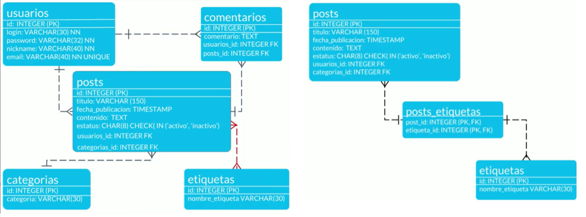

## CURSO DE FUNDAMENTOS DE BASES DE DATOS
###### Apuntes: Fuente curso Plaztzi 2024

### 1. BIENVENIDA CONCEPTOS BÁSICOS Y CONTEXTO HISTÓRICO DE LAS BASES DE DATOS

* Tipos de bases de datos:
    * Relacionales:En la industria hay varias compañías dedicadas a ser manejadoras de bases de datos relacionales como SQL Server, Oracle, MariaDB, entre otras.

    * No Relacionales: Todavía están avanzando y existen ejemplos muy distintos como cassandra, elasticsearch, neo4j, MongoDB, entre otras.

* Servicios:
    * Auto administrados: Es la base de datos que instalas tú y te encargas de actualizaciones, mantenimiento, etc.

    * Administrados: Servicios que ofrecen las nubes modernas como Azure y no debes preocuparte por mantenimiento o actualizaciones


### TIPOS DE BASES DE DATOS:
* Relacionales: Ejemplos, SQL server, MySQL, PostgreSQL, MariaDB, Oracle.

* No Relacionales: Cassandra, dinamon DB, Mongo DB.

##### HISTORIA DE LAS BASES DE DATOS RELACIONALES

[12 reglas de las BD:](https://es.wikipedia.org/wiki/12_reglas_de_Codd "Mayor detalle de las reglas de las BDs" )

[Aporte de un compañero](https://github.com/rb-one/Notas-fundamentos-bases-de-datos/blob/master/Notas/notas.md "Apuntes del curso")

### 3. Historia de las bases de datos relacionales
Las bases de datos surgen de la necesidad de conservar la información más allá de lo que existe en la memoria RAM.

### 4. Qué son entidades y atributos
* ¿Qué es una entidad?
    * Una entidad es algo similar a un objeto (programación orientada a objetos) y representa algo en el mundo real, incluso algo abstracto. Tienen atributos que son las cosas que los hacen ser una entidad y por convención se ponen en plural.

* Ejemplo de entidad en bases de datos
    * En la imagen puedes observar como ejemplo que la enidad Laptops posee diferentes atributos como colo, pantalla, año, modelo, etc.


* ¿Qué es un atributo?
    * Son las características o propiedades que describen a la entidad (se encierra en un óvalo). Los atributos se componen de:

Los atributos compuestos son aquellos que tienen atributos ellos mismos.

Los atributos llave son aquellos que identifican a la entidad y no pueden ser repetidos. Existen:

* Naturales: son inherentes al objeto como el número de serie
* Clave artificial: no es inherente al objeto y se asigna de manera arbitraria.
  
* Tipos de entidades
    * Entidades fuertes: son entidades que pueden sobrevivir por sí solas.

    * Entidades débiles: no pueden existir sin una entidad fuerte y se representan con un cuadrado con doble línea.

* Identidades débiles por identidad: no se diferencian entre sí más que por la clave de su identidad fuerte.
  
* Identidades débiles por existencia: se les asigna una clave propia.
Cómo representar las entidades en bases de datos

Existen varios tipos de notaciones para los modelos entidad relacionamiento. Chen es uno de los más utilizados para diagramar lógicamente la base de datos. Aquí te mostramos un ejemplo.


### Entidades de Platzi Blog


### Relaciones
Las relaciones tienen una propiedad llamada cardinalidad y tiene que ver con números. Cuántos de un lado pertenecen a cuántos del otro lado:

* Cardinalidad: 1 a 1
* Cardinalidad: 0 a 1
* Cardinalidad: 1 a N
* Cardinalidad: 0 a N
  


### Relaciones Múltiples muchos


### Diagrama ER
Un diagrama es como un mapa y nos ayuda a entender cuáles son las entidades con las que vamos a trabajar, cuáles son sus relaciones y qué papel van a jugar en las aplicaciones de la base de datos.


### Diagrama Físico: tipos de datos y constraints
Tipos de dato:

* Texto: CHAR(n), VARCHAR(n), TEXT
* Números: INTEGER, BIGINT, SMALLINT, DECIMAL(n,s), NUMERIC(n,s)
* Fecha/hora: DATE, TIME, DATETIME, TIMESTAMP
* Lógicos: BOOLEAN

Constraints (Restricciones)

* NOT NULL: Se asegura que la columna no tenga valores nulos
* UNIQUE: Se asegura que cada valor en la columna no se repita
* PRIMARY KEY: Es una combinación de NOT NULL y UNIQUE
* FOREIGN KEY: Identifica de manera única una tupla en otra tabla
* CHECK: Se asegura que el valor en la columna cumpla una condición dada
* DEFAULT: Coloca un valor por defecto cuando no hay un valor especificado
* INDEX: Se crea por columna para permitir búsquedas más rápidas


### Diagrama Físico: normalización

>Primera Forma Normal (1NF): Se asegura de que cada celda en una tabla contenga un solo valor, evitando la repetición de grupos de datos y permitiendo la identificación única de cada fila. Para lograr esto, se deben eliminar los valores repetidos en las columnas.

>Segunda Forma Normal (2NF): Se asegura de que todos los campos no clave de una tabla dependan completamente de la clave primaria. Esto significa que no debe haber dependencias parciales de la clave primaria; cada atributo no clave debe depender de toda la clave primaria.

>Tercera Forma Normal (3NF): Se asegura de que no existan dependencias transitivas entre las columnas no clave. En otras palabras, si un campo no clave depende de otro campo no clave, pero también depende de la clave primaria, se deben crear tablas adicionales para evitar esta dependencia transitiva.


### Diagrama Físico: normalizando Platziblog

* Diagrama BD Posts



```SQL
* (PK): Primary key
* (FK): Foreign Key
* (NN): Not Null
* (NN - UNIQUE): No valor nulo y unico
```


### Instalación local de un RDBMS (Windows)

Hay dos maneras de acceder a manejadores de bases de datos:

* Instalar en máquina local un administrador de bases relacional.
* Tener ambientes de desarrollo especiales o servicios cloud.
En este curso usaremos MySQL porque tiene un impacto histórico siendo muy utilizado y además es software libre y gratuito. La versión 5.6.43 es compatible con la mayoría de aplicaciones y frameworks.

* Root es el usuario principal que tendrá todos los permisos y por lo tanto en ambientes de producción hay que tener mucho cuidado al configurarlo.

[https://www.mysql.com/downloads/]

### ¿Qué es RDB y RDBMS?

RDBMS (Relational DataBase Management System) Sistema Manejador de Bases de datos relacionales.

La diferencia entre ambos es que las BBDD son un conjunto de datos pertenecientes ( o al menos en teoría) a un mismo tipo de contexto, que guarda los datos de forma persistente para un posterior uso, y el Sistema de gestión de BBDD o sistema manejador, es el que nos permite acceder a ella, es un software, herramienta que sirve de conexión entre las BBDD y el usuario (nos presenta una interfaz para poder gestionarla, manejarla).

#### RDBMS
* MySQL
* PostgreSQL
* Etc
  
Todas toman un lenguaje base, pero cada uno lo apropia, imponiéndole diferentes reglas y características.


